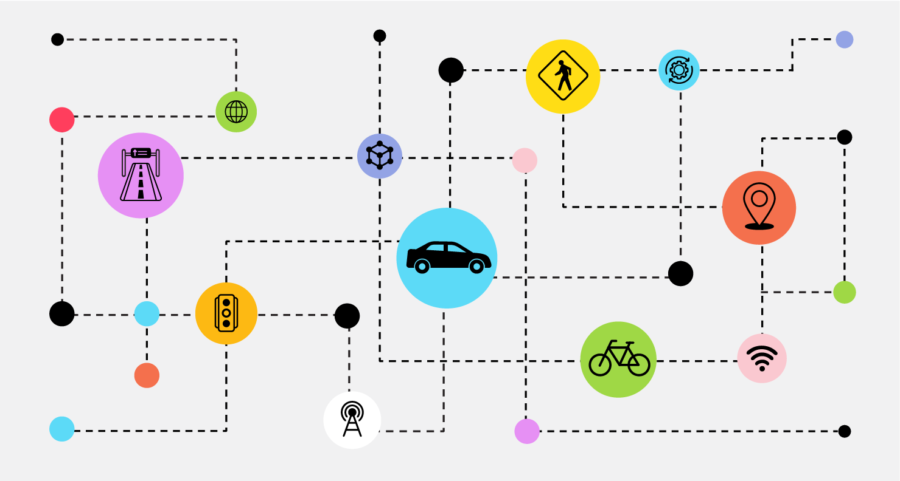

# 🌐 Kapil — Personal Web Portfolio

> A fast, modern, and minimal academic portfolio built using clean HTML/CSS and deployed via GitHub Pages.

<p align="center">
  <a href="https://kapil2020.github.io/web">
    
  </a>
</p>

<p align="center">
  <a href="https://kapil2020.github.io/web">🔴 Live Website</a> |
  <a href="#features">✨ Features</a> |
  <a href="#architecture">⚙ Architecture</a> |
  <a href="#setup">🚀 Setup</a> |
  <a href="#customisation">🎨 Customisation</a> |
  <a href="#roadmap">🧭 Roadmap</a>
</p>

---

# 🔍 Overview

This repository hosts the source code for my **personal academic portfolio website**.  
The site is intentionally **simple, lightweight, and fast**, built on:

- **HTML5**
- **CSS3**
- **Zero external frameworks**
- **GitHub Pages hosting**

The website showcases my academic profile, research areas, publications, projects, and CV.

Live Website 👉 **https://kapil2020.github.io/web**

---

# ✨ Features

### ⚡ Ultra Lightweight  
Pure HTML + CSS. No React, no frameworks, no dependencies.

### 🎨 Clean, Modern UI  
Custom design with minimalistic layout, rich typography, and elegant section separation.

### 📄 Quick CV Access  
One-click download for `kp_cv_nov.pdf`.

### 🖼 Visual Branding  
Custom images (`MobilityAI1_Cover.png`, `kp_1.png`) for a consistent academic identity.

### 📱 Responsive Design  
Works smoothly on desktop, tablet, and mobile screens.

### 🧩 Easy to Extend  
Simple folder structure—anyone can clone and reuse it as a template.

---

# ⚙ Architecture

The website follows a **static architecture**:

- `index.html` → Structure & content  
- `styles.css` → Styling & theme  
- `kp_cv_nov.pdf` → CV download  
- Images → Branding assets  
- GitHub Pages → Hosting + automatic deployment

---

# 🧭 System Workflow Diagram

> This Mermaid diagram renders directly on GitHub.

```mermaid
flowchart TD
    A[👤 User Visits<br>kapil2020.github.io/web] --> B[🌐 GitHub Pages Server]

    B --> C[index.html<br>🔹 Structure]
    B --> D[styles.css<br>🎨 Styling]
    B --> E[kp_cv_nov.pdf<br>📄 CV]
    B --> F[Images<br>🖼 Visual Assets]

    C --> G[🧠 Browser Rendering Engine]
    D --> G
    F --> G
    E --> H[⬇ CV Viewer / Download]

    G --> I[✨ Fully Rendered Portfolio<br>Displayed on Browser]

    style A fill:#00eaff,stroke:#0077ff,stroke-width:2px,color:#000
    style B fill:#1a1a1a,stroke:#00eaff,stroke-width:2px,color:#00eaff
    style C fill:#222,stroke:#0f0,stroke-width:1px
    style D fill:#222,stroke:#ff00ff,stroke-width:1px
    style E fill:#222,stroke:#ffa500,stroke-width:1px
    style F fill:#222,stroke:#00bfff,stroke-width:1px
    style G fill:#000,stroke:#fff,stroke-width:2px
    style H fill:#000,stroke:#ffa500,stroke-width:1px
    style I fill:#00ff7f,stroke:#008000,stroke-width:2px,color:#000
